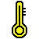

# HB-HS-Devices-addon  Noch im Bau ...

**:heavy_check_mark: lauffähig unter RaspberryMatic Firmware 3.37.x - ... und vermutlich auch CCU 2.31.x - ...** 

Die jeweils aktuellste Version ist bei den [Releases](https://github.com/schmidhorst/HB-HS-Devices-AddOn/releases) zu finden.

**Das Wichtigste vorweg:** 
Dieses Addon integriert die unten aufgelisteten HomeBrew Projekte in die CCU-Firmware. 
Ich stelle es 
* kostenfrei 
* ohne jeglichen Anspruch auf vollständige Funktion 
* auf eigene Gefahr (z.B. unerwünschte Nebeneffekte in der CCU-Firmware)

zur Verfügung. 
Da es sich um ein reines Hobby-Projekt handelt, kann ich **weder (umfangreichen) Support** leisten, **noch auf individuelle Wünsche eingehen** oder **zeitnah die neueste CCU-Firmware unterstützen**! 
Es sollte klar sein, dass mit (m)einer eventuellen Aufgabe dieses Hobbys, mittel-/langfristig (teilweise) keine Verwendung u.g. Geräte mehr möglich ist. <i>Wie bei Open Source Projekten üblich, kann sich jedoch jeder an der Entwicklung beteiligen!</i>

Nach der Installation wird automatisch ein Neustart der Zentrale durchgeführt. 
Die eigentliche Installation des Addons erfolgt nach diesem Neustart, während die Zentrale hochfährt. 
In dieser Zeit werden die Dienste **ReGaHss** und **RFD** gestoppt, so dass es **_(nicht bei RaspberryMatic!)_** im Browser zu der Meldung `Eine Komponente der Homematic Zentrale reagiert nicht mehr.` kommen kann. 
_Bitte etwas Geduld haben - je nach Geschwindigkeit der SD Karte kann die Installation u.U. mehrere Minuten in Anspruch nehmen!_  

❗ Sollten anschließend keine Geräte-Icons und/oder -beschreibungen in der WebUI angezeigt werden, muss der Browser-Cache gelöscht werden.

#### Dieses Addon wird benötigt, um die Kompatibilität der folgenden HomeMatic Selbstbaugeräte herzustellen:

|  | Name | Beschreibung | 🔋Batterie-/ ⚡️Netzbetrieb |
|--------|--------|--------|:--------:|
| | HB-HS-Sen-TEMP-DS18B20 | 1..8fach DS18B20 Temperatursensor mit optional LCD-Display | ⚡️ / 🔋 | 

**Hinweis für Entwickler** _(verwendete Device Model meiner bzw. fremd-eingebundener HB-Geräte)_ **:**

| Device Model | Gerät |
|--------|--------|
|F1 14 | HB-HS-Sen-TEMP-DS18B20 |

 Dieses Werk ist lizenziert unter einer <a rel="license" href="http://creativecommons.org/licenses/by-nc-sa/4.0/">Creative Commons Namensnennung - Nicht-kommerziell - Weitergabe unter gleichen Bedingungen 4.0 International Lizenz</a>.

Die verwendeten Icons sind "free for non-commercial use" von
 - https://www.flaticon.com/authors/popcic from www.flaticon.com 
 - http://icons8.com 
